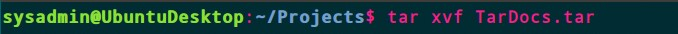
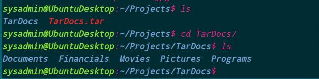
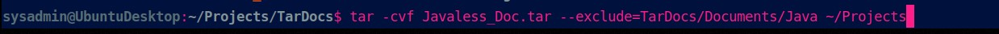
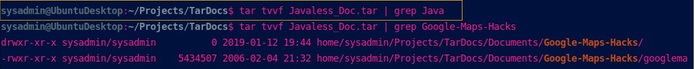
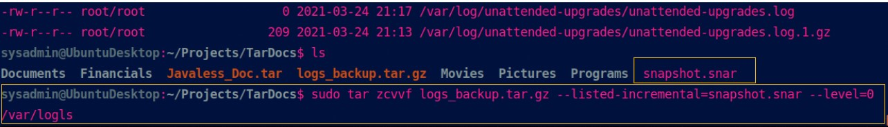
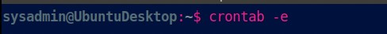
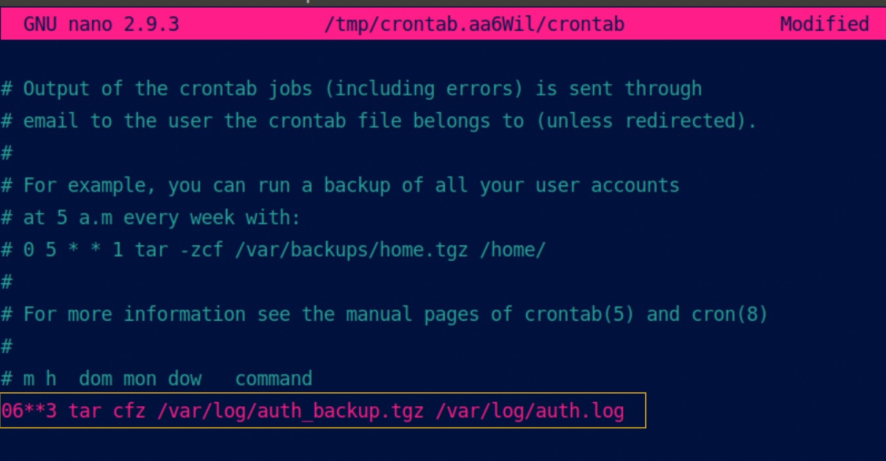
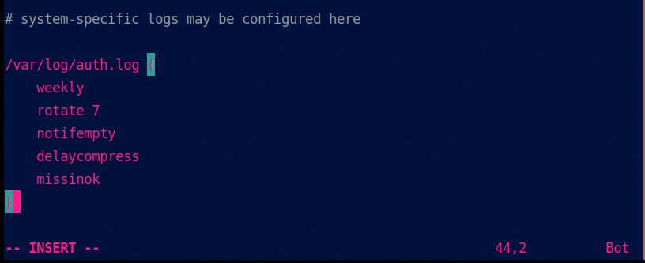

## Archiving and Logging Data

### Step 1: Create, Extract, Compress, and Manage tar Backup Archives

1. Command to **extract** the `TarDocs.tar` archive to the current directory:

&nbsp;&nbsp;
&nbsp;&nbsp;

2. Command to **create** the `Javaless_Doc.tar` archive from the `TarDocs/` directory, while excluding the `TarDocs/Documents/Java` directory:

&nbsp;&nbsp;

3. Command to ensure `Java/` is not in the new `Javaless_Docs.tar` archive:

&nbsp;&nbsp;

**Bonus** 
- Command to create an incremental archive called `logs_backup_tar.gz` with only changed files to `snapshot.file` for the `/var/log` directory:
&nbsp;&nbsp;

#### Critical Analysis Question

- Why wouldn't you use the options `-x` and `-c` at the same with `tar`? <br />

     - Because `-x` is used to extract and `-c` is used to create a tar archive.


---
<br />

### Step 2: Create, Manage, and Automate Cron Jobs

1. Cron job for backing up the `/var/log/auth.log` file:

&nbsp;&nbsp;
&nbsp;&nbsp;
---

### Step 3: Write Basic Bash Scripts

1. Brace expansion command to create the four subdirectories:

     - mkdir -p ~/backups/{freemem,diskuse,openlist,freedisk}

2. Paste your `system.sh` script edits below:

```bash
#!/bin/bash

# Prints the amount of free memory on the system 
free -ht >> ~/backups/freemem/free_mem.txt

# Prints disk usage     
df -h –output=used >> ~/backups/diskuse/disk_usage.txt

# Lists all open files 
lsof | wc -l >> ~/backups/openlist/open_list.txt

# Prints file system disk space statistics
df -h | awk -F ‘{print $1, $5}’ >> ~/backups/freedisk/free_disk.txt

```

3. Command to make the `system.sh` script executable:
chmod +x system.sh

**Optional**
- Commands to test the script and confirm its execution:

     -   sh system.sh

**Bonus**
- Command to copy `system` to system-wide cron directory:

  -  sudo mv system.sh /etc/cron.weekly

---

### Step 4. Manage Log File Sizes
 
1. Run `sudo nano /etc/logrotate.conf` to edit the `logrotate` configuration file. 

    Configure a log rotation scheme that backs up authentication messages to the `/var/log/auth.log`.
    


    - **weekly:** rotates weekly 
    - **rotate 7:** rotates only the seven most recent logs
    - **notifempty:** does not rotate empty logs
    - **delaycompress** delays compression
    - **missinok:** skips error messages for missing logs and continues to next log
---

### Bonus: Check for Policy and File Violations

1. Command to verify `auditd` is active:

    - sudo systemctl status auditd

2. Command to set number of retained logs and maximum log file size:

    -  num_logs = 7   max_log_file = 35 


3. Command using `auditd` to set rules for `/etc/shadow`, `/etc/passwd` and `/var/log/auth.log`:


    - Add the edits made to the `rules` file below:

```bash
    -w /etc/shadow -p wra -k hashpass_audit

    -w /etc/passwd -p wra -k userpass_audit

    -w /var/log/auth.log -p wra -k authlog_audit
```

4. Command to restart `auditd`: 

     -  sudo service auditd restart

5. Command to list all `auditd` rules:

     - sudo auditctl -l

6. Command to produce an audit report:

   - sudo aureport -au

7. Create a user with `sudo useradd attacker` and produce an audit report that lists account modifications:

     - sudo aureport -m

8. Command to use `auditd` to watch `/var/log/cron`:

    -   -w /var/log/cron -p wra -k watch_cron

9. Command to verify `auditd` rules:

   - sudo auditctl -l

---

### Bonus (Research Activity): Perform Various Log Filtering Techniques

1. Command to return `journalctl` messages with priorities from emergency to error:

   - sudo journalctl -p err -b


2. Command to check the disk usage of the system journal unit since the most recent boot:

   - sudo journalctl –list-boots


3. Comand to remove all archived journal files except the most recent two:

   - sudo journalctl –vacuum-time=2d


4. Command to filter all log messages with priority levels between zero and two, and save output to `/home/sysadmin/Priority_High.txt`:

   - sudo journalctl -p 0..2 >> /home/sysadmin/Priority_High.txt


5. Command to automate the last command in a daily cronjob. Add the edits made to the crontab file below:


   - @daily journalctl -p 0..2 >> /home/sysadmin/Priority_High.txt


---
© 2020 Trilogy Education Services, a 2U, Inc. brand. All Rights Reserved.
